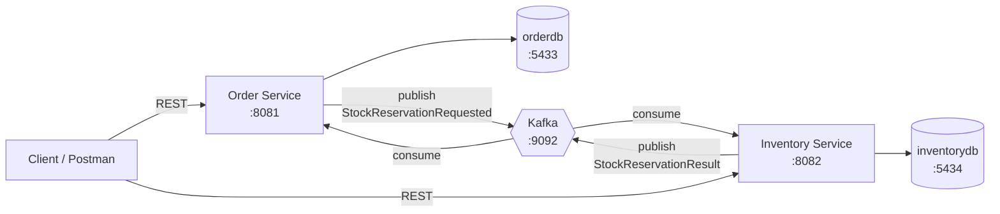
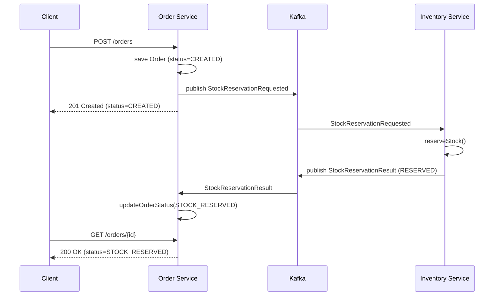

# saga-platform

An event-driven order processing system built with Spring Boot and Apache Kafka, implementing the **saga pattern** for distributed transactions across independent microservices.

This is a deliberately incremental learning project. The goal was not to ship a product as fast as possible, but to build a real distributed backend piece by piece - understanding *why* each piece exists before adding the next one. Every architectural decision below was made (and is explained) for that reason.

---

## Table of Contents

- [The Problem This Solves](#the-problem-this-solves)
- [Architecture](#architecture)
- [Tech Stack](#tech-stack)
- [Project Structure](#project-structure)
- [Getting Started](#getting-started)
- [API Reference](#api-reference)
- [The Saga Flow](#the-saga-flow)
- [Architecture & Design Decisions](#architecture--design-decisions)
- [Known Limitations](#known-limitations-honest-gaps)
- [Roadmap](#roadmap)
- [What This Project Taught Me](#what-this-project-taught-me)

---

## The Problem This Solves

Placing an order in this system requires multiple independent services to each do their own piece of work - Order Service creates the order, Inventory Service reserves stock, (eventually) Payment Service charges the customer. Each service owns its own database. That means a single ACID database transaction across all of them is not possible.

The **saga pattern** solves this: instead of one big transaction, each step commits its own local transaction, and if a later step fails, the saga runs **compensating actions** to undo the steps that already succeeded - in reverse order. Consistency is achieved through choreographed undo logic, not a distributed lock.

This project implements an **orchestration-style** saga: a central component (`SagaOrchestrator`, living in Order Service) drives the sequence and decides what happens next, rather than each service reacting independently to events with no single source of truth for the saga's overall state.

---

## Architecture



Two independently deployable services, each with:
- its own database (no service ever reads another service's tables)
- its own layered architecture (controller → service → repository)
- its own copy of any shared-shaped data contracts (more on why below)

The two services communicate **only** through Kafka events. Neither calls the other's REST API directly - that synchronous coupling existed briefly during development and was deliberately removed (see [Decision 5](#5-synchronous-rest-first-then-replaced-by-kafka)).

---

## Tech Stack

| Component | Choice | Notes |
|---|---|---|
| Language | Java 21 | Records, switch expressions, modern language features used where they aid clarity |
| Framework | Spring Boot 3.5.15 | See [Decision 12](#12-spring-boot-35x-over-40x) for why not 4.x |
| Build tool | Maven | Multi-module monorepo (two independent modules) |
| Database | PostgreSQL 16 (`postgres:16-alpine`) | One database per service, never shared |
| Messaging | Apache Kafka 3.9.2, KRaft mode | No Zookeeper - see [Decision 7](#7-kraft-mode-no-zookeeper) |
| Persistence | Spring Data JPA / Hibernate | |
| Validation | Jakarta Bean Validation | Enforced at the API edge |
| Containerization | Docker Compose | Runs both Postgres instances and Kafka locally |

---

## Project Structure

```
saga-platform/                     ← git root
├── docker-compose.yml              ← Postgres ×2 + Kafka
├── order-service/
│   └── src/main/java/com/saga/orderservice/
│       ├── controller/             ← REST endpoints
│       ├── service/                ← business logic
│       ├── saga/                   ← SagaOrchestrator
│       ├── domain/                 ← Order, OrderItem, OrderStatus (JPA entities)
│       ├── dto/                    ← request/response records
│       ├── mapper/                 ← entity ↔ DTO conversion
│       ├── event/                  ← Kafka event records, producer, listener
│       ├── repository/             ← Spring Data interfaces
│       ├── exception/              ← custom exceptions + global handler
│       └── config/
└── inventory-service/
    └── src/main/java/com/saga/inventoryservice/
        ├── controller/             ← ProductController, InventoryController
        ├── service/                ← InventoryService
        ├── domain/                 ← Product, StockReservation, ReservationStatus
        ├── dto/
        ├── mapper/
        ├── event/                  ← Kafka event records, producer, listener
        ├── repository/
        └── exception/
```

Each service is structured identically - same layering, same conventions - so understanding one means understanding the other.

---

## Getting Started

**Prerequisites:** Java 21, Maven, Docker Desktop.

```bash
git clone <this-repo-url>
cd saga-platform

# Start Postgres (×2) and Kafka
docker compose up -d
docker compose ps   # confirm all three containers are Up
```

Run each service (from an IDE, or via Maven):

```bash
cd order-service && mvn spring-boot:run
cd inventory-service && mvn spring-boot:run
```

Seed a product, then place an order:

```bash
curl -X POST http://localhost:8082/products \
  -H "Content-Type: application/json" \
  -d '{"productId": 1, "name": "Widget", "totalQuantity": 10}'

curl -X POST http://localhost:8081/orders \
  -H "Content-Type: application/json" \
  -d '{"customerId": "customer-1", "items": [{"productId": 1, "quantity": 2, "unitPrice": 29.99}]}'
```

The response will show `"status": "CREATED"` immediately. The saga resolves asynchronously - check back a moment later:

```bash
curl http://localhost:8081/orders/1
# → "status": "STOCK_RESERVED"
```

---

## API Reference

### Order Service - `:8081`

| Method | Path | Description |
|---|---|---|
| `POST` | `/orders` | Create an order and start the saga. Returns `201` with status `CREATED` immediately. |
| `GET` | `/orders/{id}` | Fetch one order by ID. `404` if not found. |
| `GET` | `/orders` | List all orders. |

### Inventory Service - `:8082`

| Method | Path | Description |
|---|---|---|
| `POST` | `/products` | Register a product with initial stock. `409` if `productId` already exists. |
| `GET` | `/products/{productId}` | Fetch current stock levels. `404` if not found. |
| `POST` | `/inventory/reserve` | Reserve stock for an order. `422` if insufficient stock. |
| `POST` | `/inventory/release` | Release a reservation (compensating action). |
| `POST` | `/inventory/confirm` | Finalize a reservation, permanently deducting stock. |

The `/inventory/*` endpoints exist for completeness and direct testing, but in the actual saga flow, reservation is driven through Kafka events, not direct calls - see below.

---

## The Saga Flow

### Happy path



1. `SagaOrchestrator` creates the order (status `CREATED`) and publishes `StockReservationRequested` to topic `stock-reservation-requested`, keyed by `orderId`.
2. The HTTP response returns **immediately** - the saga's outcome is not known yet, and the API does not wait for it.
3. Inventory Service's listener consumes the event, runs the same `reserveStock()` business logic used by the direct REST endpoint, and publishes `StockReservationResult` (`RESERVED` or `FAILED`) to `stock-reservation-result`.
4. Order Service's listener consumes the result and transitions the order to `STOCK_RESERVED` or `CANCELLED`.

### Failure path

If the requested quantity exceeds what's available, Inventory Service's listener catches `InsufficientStockException` internally, publishes `StockReservationResult(outcome=FAILED, reason=...)`, and Order Service moves the order straight to `CANCELLED`. No compensation is needed here, because nothing had succeeded yet - this is a single failed step, not a rollback of a prior success.

The **true backward-compensation scenario** - reservation succeeds, then a *later* step (payment) fails, requiring Inventory Service's `/inventory/release` to undo an already-successful reservation - is not yet exercisable, because there is currently only one fallible saga step. It arrives naturally once Payment Service is built (see [Roadmap](#roadmap)).

---

## Architecture & Design Decisions

### 1. Orchestration over choreography
**Decision:** A central `SagaOrchestrator` drives the saga, rather than each service reacting independently to events with no single coordinator.
**Why:** Choreography (services reacting to each other's events with no central authority) scales better to many steps but is harder to reason about and debug, especially while learning the pattern itself. Orchestration keeps "what should happen next" in one readable place.

### 2. One database per service - no exceptions
**Decision:** Order Service and Inventory Service each have their own PostgreSQL database, with no shared schema and no cross-service joins.
**Why:** This is the foundational rule that makes services genuinely independent. If Inventory Service's schema changes, Order Service is never affected - there's no way it *could* be, because it has no access to Inventory's tables at all. The only way one service learns anything about another's state is through an explicit API or event.

### 3. DTOs at every API boundary - entities never leave the service layer
**Decision:** Controllers receive and return DTOs (Java records), never JPA entities.
**Why:** Three concrete reasons: (1) entities carry Hibernate proxy state that can trigger lazy-loading exceptions or surprise queries during JSON serialization; (2) the database shape and the API contract are allowed to evolve independently; (3) entities expose more than callers should be able to set (e.g. directly setting `status` on creation), which would bypass business rules.

### 4. Business invariants live inside entities, not services
**Decision:** `Product.reserve()`, `release()`, and `confirmDeduction()` enforce stock rules (e.g. you cannot reserve more than is available) directly on the entity. Similarly, `Order` and `StockReservation` only expose named state-transition methods, never raw setters.
**Why:** If "reserved can never exceed total" lived in the service layer, every future caller of `Product` would have to remember to re-implement that check correctly. Putting it on the entity itself makes an invalid state structurally unreachable through the class's public API - this is encapsulation doing real, load-bearing work, not just a style preference.

### 5. Synchronous REST first, then replaced by Kafka
**Decision:** The saga was first implemented with `SagaOrchestrator` calling Inventory Service directly over REST (via a `RestClient`-based `InventoryClient` interface), and only *afterward* replaced with Kafka events. The REST-based classes were deleted once replaced, rather than left in place.
**Why:** Proving the saga's decision logic (reserve → success/failure → update order status) works correctly is easier to verify when the call is synchronous and the result is immediately visible. Introducing messaging at the same time as the saga logic itself would have made it harder to tell which part of a bug belonged to which concept. Deleting the superseded code once Kafka replaced it avoids leaving dead, unreferenced classes in a project meant to demonstrate clean practice.

### 6. Kafka for inter-service communication
**Decision:** Order Service and Inventory Service communicate exclusively through Kafka topics, not direct REST calls.
**Why:** A synchronous call couples the caller's success to the callee's uptime and latency *at that exact instant*. Publishing an event decouples the two services in time - Inventory Service can be temporarily down or slow without Order Service's order-creation endpoint failing or blocking. The tradeoff, made explicit rather than hidden: the HTTP response to `POST /orders` can no longer report the saga's final outcome, since that outcome isn't known yet when the response is sent.

### 7. KRaft mode (no Zookeeper)
**Decision:** Kafka runs in KRaft combined mode (a single node acting as both broker and controller), with no Zookeeper.
**Why:** Zookeeper-based Kafka is deprecated and was removed entirely starting with Kafka 4.0 - KRaft is now the only supported mode going forward. It's also simpler to run locally: one container instead of two.

### 8. Kafka messages keyed by `orderId`
**Decision:** Every event published about a given order uses that order's ID as the Kafka message key.
**Why:** Kafka guarantees that messages sharing the same key always land in the same partition and are processed in the order they were sent, relative to each other. Keying by `orderId` guarantees every event about a given order (reservation request, then later result, then eventually release/confirm) is processed in the correct order - without this, two messages about the same order could theoretically be processed out of sequence.

### 9. Kafka type headers disabled, explicit `default.type` per consumer
**Decision:** `spring.json.add.type.headers` and `spring.json.use.type.headers` are both set to `false`; each consumer instead declares `spring.json.value.default.type` explicitly.
**Why:** Spring Kafka's `JsonSerializer` writes the producing class's fully-qualified name into a message header by default, and the consumer uses that name to decide what to deserialize into. Because each service owns its **own** copy of the event classes (see next decision), the same logical event has two different fully-qualified class names depending on which service produced or is consuming it. Left at defaults, deserialization would fail outright. Disabling type headers and telling each consumer directly what to expect sidesteps the mismatch entirely.

### 10. Event and DTO classes duplicated per service, never shared
**Decision:** Each service maintains its own copy of any data shape it needs to exchange with the other - its own `StockReservationRequested`, its own `StockItemRequest`, etc. - rather than importing a shared library of common classes.
**Why:** A shared class would compile-time couple the two services: changing one would force a rebuild and version bump on both, even though they're meant to be independently deployable. Each service owning its understanding of "the contract" - even when that means near-identical classes living in two places - is the actual cost of true service independence, paid deliberately rather than avoided for the sake of DRY.

### 11. Stock held via `reservedQuantity`, not deducted on order - until confirmed
**Decision:** Reserving stock increments `Product.reservedQuantity`; it does not decrement `totalQuantity`. Only `confirmDeduction()` (called once a later step, like payment, succeeds) actually reduces `totalQuantity`. Available stock is always `totalQuantity - reservedQuantity`, computed on demand, never stored separately.
**Why:** This models how inventory holds actually work in the real world - stock is earmarked, not removed, until the sale is truly final. It's also what makes compensation possible at all: releasing a reservation just removes the hold, with nothing physical to "put back," because nothing physical ever left.

### 12. Spring Boot 3.5.x over 4.x
**Decision:** The project deliberately targets Spring Boot 3.5.15 rather than the newer 4.x line.
**Why:** Stability and documentation/tutorial coverage matter more for a project meant to teach foundational concepts clearly than being on the latest major version. The same reasoning applied to choosing Kafka 3.9.2 over the newer 4.x releases.

### 13. `EnumType.STRING`, not the JPA default `ORDINAL`
**Decision:** Every persisted enum (`OrderStatus`, `ReservationStatus`) is stored as its name (`"STOCK_RESERVED"`), not its ordinal position.
**Why:** `ORDINAL` storage means the meaning of a stored value depends on the *order* enum constants are declared in. Inserting a new constant anywhere but the end silently corrupts every existing row's meaning. `STRING` storage is immune to this, and is also directly readable in a database client without translation.

### 14. `BigDecimal` for all monetary values
**Decision:** Prices (`unitPrice`) use `BigDecimal`, never `double` or `float`.
**Why:** Binary floating-point types cannot represent most decimal fractions exactly, which compounds into real accounting errors over repeated calculations. `BigDecimal` is the standard, correct choice for money in Java, at the small cost of slightly more verbose arithmetic.

### 15. Centralized exception handling with deliberately distinct HTTP status codes
**Decision:** Each service has one `@RestControllerAdvice` mapping exceptions to status codes - and the codes are chosen deliberately, not interchangeably: `404` for "doesn't exist," `409` for "conflicts with something that already exists" (e.g. duplicate `productId`), `422` for "well-formed but violates a business rule" (e.g. insufficient stock), `400` for failed input validation.
**Why:** Centralizing error handling means controllers and services never build error responses themselves - one place to look, one consistent shape returned to every caller. Distinguishing `409` from `422` specifically communicates *why* a request failed in a way a generic "error" status can't: one is about a clash of identity, the other about a business constraint.

### 16. Constructor injection exclusively - no field injection
**Decision:** Every Spring-managed class declares its dependencies as `private final` fields, injected through the constructor.
**Why:** This is the Dependency Inversion Principle made concrete in Spring: a class depends on an abstraction (an interface or another Spring bean), and the concrete implementation is supplied by the container. Constructor injection makes every dependency explicit and `final`, and - critically - makes a class testable in plain JUnit without starting a Spring context at all, since you can simply pass in fakes through the constructor.

### 17. Monorepo, not separate repositories
**Decision:** Both services live in one git repository, under one root, rather than two separate repos.
**Why:** For a project of this size, a single repository keeps shared infrastructure config (`docker-compose.yml`) and the overall story of how the system was built together in one place. The commit history itself reads as a build-up - skeleton, domain model, REST layer, second service, synchronous orchestration, Kafka - which is part of the point of the project as a portfolio artifact.

---

## Known Limitations (Honest Gaps)

These are not oversights - they're deliberately deferred, in line with the project's incremental philosophy of not building a concept before there's a real reason to.

- **No outbox pattern yet.** `KafkaTemplate.send()` in both producers is fire-and-forget - there is no guarantee a message survives a crash occurring between the database commit and the publish call (the "dual-write problem"). The outbox pattern - writing the event to a database table in the *same* transaction as the business change, then publishing from a separate poller - is the next item on the roadmap.

- **No idempotency protection yet - and a real bug proved why it's needed.** During development, a producer misconfiguration (a serializer pointed at the wrong class) caused an exception to escape uncaught from Inventory Service's `@KafkaListener`. Spring Kafka's default error handling treated the message as unprocessed and **redelivered it roughly ten times**, and each redelivery re-ran the full reservation logic - inflating that test order's `reservedQuantity` by roughly 10×. This wasn't a theoretical concern by the time it was understood; it was observed firsthand, on this exact codebase, as a direct consequence of at-least-once delivery semantics with no idempotency guard in place. Fixing the misconfiguration solved that specific incident, but the underlying gap - nothing stops `reserveStock()` from running twice for a genuinely redelivered message - remains, and is exactly what the idempotency step on the roadmap exists to close.

- **No backward compensation has been exercised yet.** `Inventory Service`'s `/inventory/release` endpoint exists and is independently tested, but nothing currently calls it as part of the saga, because there is only one fallible step (reservation) right now. The real "step 2 succeeded, step 3 failed, walk backward" scenario requires Payment Service to exist.

- **No authentication or authorization.** Deliberately out of scope - this project is about the saga pattern, not access control.

- **No automated tests yet.** Everything has been verified manually via Postman and console logs throughout development. Unit and integration tests are on the roadmap.

- **No distributed tracing or observability.** A single order's journey across both services currently has to be followed by reading logs side by side.

---

## Roadmap

1. **Outbox pattern** - reliable event publishing, immune to the dual-write problem
2. **Idempotency keys** - make reservation (and later, payment) processing safe to run more than once
3. **Payment Service** - the second fallible saga step, enabling real backward compensation
4. **Notification Service** - the terminal, non-compensating step
5. **Tests** - JUnit 5 + Mockito for business logic, Testcontainers for integration tests against real Postgres/Kafka
6. **Observability** - OpenTelemetry tracing across both services for a single order

---

## What This Project Taught Me

- Why distributed transactions can't just be "one big transaction" - and what the saga pattern actually buys you instead
- The dual-write problem, concretely - and why the outbox pattern exists as a direct answer to it
- At-least-once delivery isn't an abstract Kafka detail - I hit a real bug caused by it, and watched a single misconfigured serializer turn into ten duplicate reservations
- Why "service data ownership" is a hard architectural rule, not a guideline - and what actually breaks if you violate it
- The real tradeoff of going from synchronous to event-driven: you gain decoupling, but you give up the ability to return a final answer in the original response
- How much design intent can live inside a domain entity itself, rather than scattered across a service layer

---

*This is a personal learning project. It is not licensed for production use as-is.*
